# Alive Yang's Blog

个人技术博客，使用 Hugo 构建，部署在 GitHub Pages。

🔗 **在线访问**: [https://aliveyang.github.io/](https://aliveyang.github.io/)

## 技术栈

- **静态站点生成器**: [Hugo](https://gohugo.io/) v0.134+
- **主题**: [Yelee](https://github.com/NightFarmer/hugo-theme-yelee)
- **评论系统**: [Giscus](https://giscus.app/) (基于 GitHub Discussions)
- **部署**: GitHub Actions + GitHub Pages
- **CDN**: jsDelivr (jQuery, Font Awesome)

## 功能特性

- ✅ **响应式设计** - 支持桌面和移动设备
- ✅ **代码高亮** - 支持多种编程语言语法高亮
- ✅ **评论系统** - 基于 GitHub Discussions 的 Giscus 评论
- ✅ **图片懒加载** - 优化页面加载性能
- ✅ **目录导航** - 自动生成文章目录
- ✅ **标签分类** - 支持文章标签和分类
- ✅ **媒体嵌入** - 支持音乐、视频（Bilibili、YouTube）
- ✅ **性能优化** - HTML/CSS/JS 压缩，CDN 加速
- ✅ **自动部署** - 推送到 dev 分支自动构建部署

## 快速开始

### 环境要求

- **Hugo**: v0.134+ (推荐使用 Extended 版本以支持 SCSS)
- **Git**: 用于版本控制
- **文本编辑器**: VS Code、Sublime Text 等
- **操作系统**: Windows、macOS、Linux

### 安装 Hugo

#### Windows

**方法 1: 使用 Chocolatey**
```bash
choco install hugo-extended
```

**方法 2: 使用 Scoop**
```bash
scoop install hugo-extended
```

**方法 3: 手动安装**
1. 访问 [Hugo Releases](https://github.com/gohugoio/hugo/releases)
2. 下载 `hugo_extended_*_windows-amd64.zip`
3. 解压到任意目录（如 `C:\Hugo\bin`）
4. 将该目录添加到系统 PATH 环境变量

#### macOS

```bash
# 使用 Homebrew
brew install hugo
```

#### Linux

```bash
# Ubuntu/Debian
sudo apt install hugo

# 或下载最新版本
wget https://github.com/gohugoio/hugo/releases/download/v0.134.3/hugo_extended_0.134.3_linux-amd64.deb
sudo dpkg -i hugo_extended_0.134.3_linux-amd64.deb
```

**验证安装**：
```bash
hugo version
# 应显示: hugo v0.134.3+extended ...
```

### 克隆项目

```bash
# 克隆仓库
git clone https://github.com/aliveyang/aliveyang.github.io.git
cd aliveyang.github.io

# 切换到开发分支
git checkout dev

# 如果主题是 submodule，需要初始化
git submodule update --init --recursive
```

### 本地开发

#### 启动开发服务器

**Windows**:
```bash
# 使用便利脚本
dev.bat

# 或直接使用 Hugo
hugo server -w -D
```

**macOS/Linux**:
```bash
hugo server -w -D
```

**参数说明**：
- `-w` 或 `--watch`: 监听文件变化，自动重新构建
- `-D` 或 `--buildDrafts`: 包含草稿文章
- `--disableFastRender`: 禁用快速渲染（完整重建）
- `-p 1313`: 指定端口（默认 1313）

访问 http://localhost:1313 查看本地预览。

#### 开发服务器特性

- **热重载**: 修改文件后自动刷新浏览器
- **草稿预览**: 可以预览 `draft = true` 的文章
- **实时编辑**: 编辑器和浏览器同步更新

## 内容管理

### 创建新文章

#### 使用 Hugo 命令

```bash
# 创建新文章
hugo new post/my-new-post.md

# 创建带日期的文章
hugo new post/2026-01-04-my-post.md

# 创建特定分类的文章
hugo new post/tech/golang-tutorial.md
```

#### 手动创建

在 `content/post/` 目录下创建 `.md` 文件：

```bash
content/post/my-new-post.md
```

### 文章 Front Matter 详解

Front Matter 是文章开头的元数据配置，使用 TOML 格式（`+++` 包围）：

```toml
+++
# 必填字段
title = "文章标题"                    # 文章标题
date = 2026-01-04T10:30:00+08:00    # 发布日期（ISO 8601 格式）

# 可选字段
draft = false                        # 是否为草稿（true 不会发布）
tags = ["Hugo", "博客", "技术"]      # 标签（数组）
categories = ["技术"]                # 分类（数组）
description = "文章简短描述"         # SEO 描述
keywords = ["关键词1", "关键词2"]    # SEO 关键词

# 评论控制
comments = true                      # 是否启用评论（默认 true）

# 自定义字段
author = "Alive Yang"                # 作者
toc = true                           # 是否显示目录
weight = 1                           # 排序权重（数字越小越靠前）
+++

**文章摘要或引言**

这部分内容会显示在文章列表页面。

<!--more-->

# 正文开始

这里是文章的完整内容。
```

#### Front Matter 字段说明

| 字段 | 类型 | 必填 | 说明 |
|------|------|------|------|
| `title` | String | ✅ | 文章标题，显示在页面顶部 |
| `date` | DateTime | ✅ | 发布日期，影响文章排序 |
| `draft` | Boolean | ❌ | 草稿标记，`true` 时不会发布到生产环境 |
| `tags` | Array | ❌ | 标签列表，用于文章分类 |
| `categories` | Array | ❌ | 分类列表，更高层级的分类 |
| `description` | String | ❌ | 文章描述，用于 SEO 和社交分享 |
| `keywords` | Array | ❌ | 关键词，用于 SEO |
| `comments` | Boolean | ❌ | 是否启用评论，默认 `true` |
| `author` | String | ❌ | 作者名称 |
| `weight` | Integer | ❌ | 排序权重，数字越小越靠前 |

### 文章内容编写

#### Markdown 基础语法

```markdown
# 一级标题
## 二级标题
### 三级标题

**粗体文本**
*斜体文本*
~~删除线~~

- 无序列表项 1
- 无序列表项 2

1. 有序列表项 1
2. 有序列表项 2

[链接文本](https://example.com)


> 引用文本

`行内代码`

​```python
# 代码块
def hello():
    print("Hello, World!")
​```
```

#### 代码高亮

支持多种编程语言的语法高亮：

````markdown
```python
def fibonacci(n):
    if n <= 1:
        return n
    return fibonacci(n-1) + fibonacci(n-2)
```

```javascript
const greeting = (name) => {
    console.log(`Hello, ${name}!`);
};
```

```go
func main() {
    fmt.Println("Hello, Go!")
}
```
````

支持的语言：`python`, `javascript`, `go`, `java`, `c`, `cpp`, `rust`, `bash`, `sql`, `html`, `css`, `json`, `yaml`, `toml`, `markdown` 等。

#### 插入图片

**本地图片**：
```markdown

```

图片文件放在 `static/images/` 目录下。

**外部图片**：
```markdown

```

**使用懒加载 Shortcode**（推荐）：
```markdown

```

#### 插入链接

**普通链接**：
```markdown
[Hugo 官网](https://gohugo.io/)
```

**在新标签页打开**：
```markdown
<a href="https://gohugo.io/" target="_blank">Hugo 官网</a>
```

**锚点链接**：
```markdown
[跳转到章节](#章节标题)
```

#### 表格

```markdown
| 列1 | 列2 | 列3 |
|-----|-----|-----|
| 内容1 | 内容2 | 内容3 |
| 内容4 | 内容5 | 内容6 |

# 对齐方式
| 左对齐 | 居中 | 右对齐 |
|:-------|:----:|-------:|
| 内容   | 内容 | 内容   |
```

#### 任务列表

```markdown
- [x] 已完成任务
- [ ] 未完成任务
- [ ] 待办事项
```

### 使用 Shortcodes

Shortcodes 是 Hugo 提供的扩展功能，用于插入复杂内容。

#### 音乐播放器（网易云音乐）

```markdown

```

**参数说明**：
- 第一个参数：网易云音乐外链地址
- `right`：可选，设置播放器靠右显示

**获取外链地址**：
1. 打开网易云音乐网页版
2. 找到想要分享的歌曲
3. 点击"生成外链播放器"
4. 复制 iframe 中的 src 地址

#### Bilibili 视频

```markdown

```

**参数说明**：
- 支持 BV 号：`BV1e44y1i7Kt`
- 支持 AV 号：`av12345678`

**获取视频 ID**：
从 Bilibili 视频 URL 中提取：
- `https://www.bilibili.com/video/BV1e44y1i7Kt` → `BV1e44y1i7Kt`

#### YouTube 视频

```markdown

```

**参数说明**：
- 参数为 YouTube 视频 ID

**获取视频 ID**：
从 YouTube URL 中提取：
- `https://www.youtube.com/watch?v=w7Ft2ymGmfc` → `w7Ft2ymGmfc`

#### 自定义视频

```markdown

```

### 文章草稿管理

#### 创建草稿

在 Front Matter 中设置：
```toml
+++
title = "草稿文章"
draft = true
+++
```

#### 预览草稿

```bash
# 本地预览包含草稿
hugo server -D

# 构建包含草稿（不推荐用于生产）
hugo --buildDrafts
```

#### 发布草稿

将 `draft = true` 改为 `draft = false` 或删除该行。

### 文章分类和标签

#### 使用标签

```toml
+++
tags = ["Hugo", "博客", "技术", "教程"]
+++
```

标签页面自动生成：`/tags/hugo/`

#### 使用分类

```toml
+++
categories = ["技术", "生活"]
+++
```

分类页面自动生成：`/categories/技术/`

#### 标签 vs 分类

- **标签**：细粒度的主题标记，一篇文章可以有多个标签
- **分类**：粗粒度的内容分组，通常一篇文章属于一个分类

### 构建生产版本

#### 构建命令

**Windows**:
```bash
# 使用便利脚本
build.bat

# 或直接使用 Hugo
hugo --minify
```

**macOS/Linux**:
```bash
hugo --minify
```

**参数说明**：
- `--minify`: 压缩 HTML/CSS/JS，减小文件体积
- `--cleanDestinationDir`: 构建前清理输出目录
- `--gc`: 构建后运行垃圾回收

#### 构建输出

生成的文件位于 `./public/` 目录：

```
public/
├── index.html           # 首页
├── post/                # 文章页面
│   ├── my-post/
│   │   └── index.html
├── tags/                # 标签页面
├── categories/          # 分类页面
├── css/                 # 样式文件
├── js/                  # JavaScript 文件
├── images/              # 图片资源
└── sitemap.xml          # 站点地图
```

#### 验证构建

```bash
# 预览构建结果
hugo server -s public

# 或使用 Python 简单服务器
cd public
python -m http.server 8000
```

访问 http://localhost:8000 查看构建结果。

## 项目结构

```
.
├── content/              # 内容文件
│   └── post/            # 博客文章
├── layouts/             # 自定义布局（覆盖主题）
│   ├── partials/        # 部分模板
│   │   ├── giscus.html  # Giscus 评论组件
│   │   └── post.html    # 文章模板
│   └── shortcodes/      # 自定义短代码
├── themes/              # 主题文件
│   └── yelee/           # Yelee 主题
├── static/              # 静态资源
├── public/              # 构建输出（不提交）
├── .github/
│   └── workflows/
│       └── action.yml   # GitHub Actions 部署配置
├── config.toml          # Hugo 配置文件
├── CLAUDE.md            # Claude Code 项目指南
├── GISCUS_SETUP.md      # Giscus 配置指南
├── PERFORMANCE.md       # 性能优化文档
└── README.md            # 本文件
```

## 部署流程

本项目使用双分支工作流和 GitHub Actions 实现自动化部署。

### 分支说明

#### dev 分支（开发分支）
- **用途**: 存储源代码和内容文件
- **内容**: Markdown 文章、配置文件、主题文件等
- **工作流**: 在此分支进行所有开发和内容编辑

#### main 分支（部署分支）
- **用途**: 存储构建后的静态文件
- **内容**: HTML、CSS、JS 等静态资源
- **工作流**: 由 GitHub Actions 自动更新，不要手动修改

### 自动部署流程

```mermaid
graph LR
    A[编辑内容] --> B[提交到 dev]
    B --> C[推送到 GitHub]
    C --> D[触发 GitHub Actions]
    D --> E[Hugo 构建]
    E --> F[推送到 main]
    F --> G[GitHub Pages 部署]
    G --> H[网站更新]
```



#### 详细步骤

1. **本地开发**
   ```bash
   # 在 dev 分支工作
   git checkout dev

   # 创建或编辑文章
   hugo new post/my-article.md

   # 本地预览
   hugo server -D
   ```

2. **提交更改**
   ```bash
   # 添加文件
   git add content/post/my-article.md

   # 提交
   git commit -m "feat: 添加新文章 - 我的文章标题"
   ```

3. **推送触发部署**
   ```bash
   # 推送到 dev 分支
   git push origin dev
   ```

4. **自动构建**
   - GitHub Actions 自动检测到推送
   - 运行 Hugo 构建命令
   - 生成静态文件到 `./public/`

5. **自动部署**
   - 将 `./public/` 内容推送到 main 分支
   - GitHub Pages 自动更新网站
   - 通常 1-2 分钟内完成

### GitHub Actions 配置

工作流文件位于 `.github/workflows/action.yml`：

```yaml
name: Deploy Hugo Site

on:
  push:
    branches:
      - dev  # 监听 dev 分支
  workflow_dispatch:  # 支持手动触发

jobs:
  deploy:
    runs-on: ubuntu-latest
    steps:
      - name: Checkout
        uses: actions/checkout@v4
        with:
          submodules: true
          fetch-depth: 0

      - name: Setup Hugo
        uses: peaceiris/actions-hugo@v3
        with:
          hugo-version: 'latest'

      - name: Build
        run: hugo --minify

      - name: Deploy
        uses: peaceiris/actions-gh-pages@v4
        with:
          external_repository: aliveyang/aliveyang.github.io
          personal_token: ${{ secrets.MY_BLOG_ACTION_PAGE }}
          publish_dir: ./public
          publish_branch: main
```

#### 配置说明

| 配置项 | 说明 |
|--------|------|
| `on.push.branches` | 触发分支，设置为 `dev` |
| `workflow_dispatch` | 允许手动触发工作流 |
| `hugo-version` | Hugo 版本，`latest` 表示最新版 |
| `external_repository` | 目标仓库 |
| `personal_token` | GitHub Personal Access Token |
| `publish_dir` | 发布目录，Hugo 构建输出 |
| `publish_branch` | 目标分支，设置为 `main` |

### 手动触发部署

如果需要手动触发部署（不推送代码）：

1. 访问 GitHub 仓库页面
2. 点击 **Actions** 标签
3. 选择 **Deploy Hugo Site** 工作流
4. 点击 **Run workflow** 按钮
5. 选择 `dev` 分支
6. 点击 **Run workflow** 确认

### 查看部署状态

#### 在 GitHub 上查看

1. 访问仓库的 **Actions** 页面
2. 查看最新的工作流运行记录
3. 点击查看详细日志

#### 部署状态标识

- ✅ **绿色勾号**: 部署成功
- ❌ **红色叉号**: 部署失败
- 🟡 **黄色圆圈**: 正在部署

#### 部署失败排查

如果部署失败，检查以下几点：

1. **Hugo 构建错误**
   - 查看 Actions 日志中的错误信息
   - 本地运行 `hugo --minify` 测试
   - 检查 Front Matter 格式是否正确

2. **权限问题**
   - 确认 `MY_BLOG_ACTION_PAGE` token 有效
   - 检查 token 是否有 `repo` 权限

3. **配置错误**
   - 检查 `config.toml` 语法
   - 确认 `baseURL` 设置正确

### 配置 Personal Access Token

首次部署需要配置 GitHub Personal Access Token：

#### 创建 Token

1. 访问 GitHub Settings → Developer settings → Personal access tokens → Tokens (classic)
2. 点击 **Generate new token (classic)**
3. 设置 Token 名称：`Blog Deploy Token`
4. 选择权限：
   - ✅ `repo` (完整仓库访问权限)
   - ✅ `workflow` (工作流权限)
5. 设置过期时间（建议选择 "No expiration"）
6. 点击 **Generate token**
7. **立即复制 token**（只显示一次）

#### 配置 Secret

1. 访问仓库 Settings → Secrets and variables → Actions
2. 点击 **New repository secret**
3. Name: `MY_BLOG_ACTION_PAGE`
4. Value: 粘贴刚才复制的 token
5. 点击 **Add secret**

### 本地手动部署（不推荐）

如果需要手动部署（不使用 GitHub Actions）：

```bash
# 1. 构建静态文件
hugo --minify

# 2. 切换到 main 分支
git checkout main

# 3. 复制构建文件
cp -r public/* .

# 4. 提交并推送
git add .
git commit -m "deploy: 更新网站"
git push origin main

# 5. 切换回 dev 分支
git checkout dev
```

**注意**: 不推荐手动部署，容易出错且繁琐。

## 开发指南

### 开发工作流

#### 标准工作流

```bash
# 1. 确保在 dev 分支
git checkout dev
git pull origin dev

# 2. 创建功能分支（可选）
git checkout -b feature/new-article

# 3. 开发和测试
hugo new post/my-article.md
hugo server -D

# 4. 提交更改
git add .
git commit -m "feat: 添加新文章"

# 5. 推送到远程
git push origin feature/new-article

# 6. 合并到 dev（或创建 Pull Request）
git checkout dev
git merge feature/new-article
git push origin dev
```

#### 快速工作流（小改动）

```bash
# 直接在 dev 分支工作
git checkout dev

# 编辑文件
vim content/post/my-article.md

# 提交并推送
git add .
git commit -m "fix: 修正文章中的错别字"
git push origin dev
```

### Git Commit 规范

使用 [Conventional Commits](https://www.conventionalcommits.org/) 规范：

#### Commit 类型

| 类型 | 说明 | 示例 |
|------|------|------|
| `feat` | 新功能 | `feat: 添加评论系统` |
| `fix` | Bug 修复 | `fix: 修复图片加载问题` |
| `docs` | 文档更新 | `docs: 更新 README` |
| `style` | 样式调整 | `style: 优化移动端布局` |
| `refactor` | 代码重构 | `refactor: 重构主题配置` |
| `perf` | 性能优化 | `perf: 启用图片懒加载` |
| `test` | 测试相关 | `test: 添加构建测试` |
| `chore` | 构建/工具 | `chore: 更新依赖` |
| `content` | 内容更新 | `content: 发布新文章` |

#### Commit 格式

```
<type>(<scope>): <subject>

<body>

<footer>
```

**示例**：
```bash
git commit -m "feat(comments): 集成 Giscus 评论系统

- 添加 Giscus 配置到 config.toml
- 创建评论组件 layouts/partials/giscus.html
- 更新文章模板集成评论功能

Closes #123"
```

### 便利脚本

项目提供了便利脚本简化常用操作（Windows）：

#### dev.bat - 开发服务器

```batch
@echo off
echo Starting Hugo development server...
hugo server -w -D --disableFastRender
pause
```

**使用**：
```bash
# 双击运行或命令行执行
dev.bat
```

#### build.bat - 构建生产版本

```batch
@echo off
echo Building Hugo site...
hugo --minify --cleanDestinationDir
echo Build complete! Files are in ./public/
pause
```

**使用**：
```bash
build.bat
```

#### 创建更多便利脚本

**new-post.bat** - 快速创建文章：
```batch
@echo off
set /p title="文章标题: "
set /p slug="URL slug (留空使用标题): "

if "%slug%"=="" (
    hugo new post/%title%.md
) else (
    hugo new post/%slug%.md
)

echo 文章已创建！
pause
```

**deploy.bat** - 快速部署：
```batch
@echo off
echo Committing changes...
git add .
set /p message="Commit message: "
git commit -m "%message%"

echo Pushing to GitHub...
git push origin dev

echo Deployment triggered!
pause
```

### 文件忽略规则

`.gitignore` 配置：

```gitignore
# Hugo 构建输出
/public/
/resources/_gen/
.hugo_build.lock

# Hugo 缓存
resources/
.cache/

# IDE 配置
.idea/
.vscode/
*.swp
*.swo
*~

# 操作系统文件
.DS_Store
Thumbs.db

# 日志文件
*.log

# 临时文件
*.tmp
*.bak

# 本地配置（如果有）
config.local.toml
```

### 忽略特定文章

在 `config.toml` 中配置：

```toml
# 忽略匹配这些模式的文件
ignoreFiles = [
  "draft\\.md$",      # 忽略 draft.md
  "private\\.md$",    # 忽略 private.md
  "我的模板\\.md$",    # 忽略中文文件名
  "^content/post/temp/",  # 忽略 temp 目录
]
```

### 主题定制

#### 覆盖主题文件

Hugo 允许在项目根目录覆盖主题文件：

```
项目根目录/
├── layouts/              # 覆盖主题 layouts
│   ├── partials/
│   │   └── header.html   # 覆盖主题的 header
│   └── _default/
│       └── single.html   # 覆盖文章模板
├── static/               # 覆盖主题 static
│   ├── css/
│   │   └── custom.css    # 自定义样式
│   └── js/
│       └── custom.js     # 自定义脚本
└── themes/yelee/         # 原主题文件
```

#### 自定义样式

创建 `static/css/custom.css`：

```css
/* 自定义样式 */
.article-title {
  color: #333;
  font-size: 2rem;
}

/* 暗色模式 */
@media (prefers-color-scheme: dark) {
  .article-title {
    color: #fff;
  }
}
```

在主题中引入：
```html
<!-- layouts/partials/head.html -->
<link rel="stylesheet" href="/css/custom.css">
```

#### 创建自定义 Shortcode

在 `layouts/shortcodes/` 创建新的 shortcode：

**alert.html**:
```html
<div class="alert alert-{{ .Get 0 }}">
  {{ .Inner | markdownify }}
</div>
```

**使用**：
```markdown

这是一条提示信息

```

### 性能优化建议

#### 图片优化

1. **压缩图片**
   ```bash
   # 使用 ImageMagick
   convert input.jpg -quality 85 output.jpg

   # 批量压缩
   for img in *.jpg; do
     convert "$img" -quality 85 "optimized_$img"
   done
   ```

2. **转换为 WebP**
   ```bash
   # 使用 cwebp
   cwebp -q 85 input.jpg -o output.webp
   ```

3. **使用懒加载**
   ```markdown
   
   ```

#### 代码优化

1. **启用压缩**
   ```toml
   # config.toml
   [minify]
     [minify.tdewolff.html]
       keepWhitespace = false
     [minify.tdewolff.css]
       precision = 1
     [minify.tdewolff.js]
       precision = 1
   ```

2. **启用缓存**
   ```toml
   [caches]
     [caches.assets]
       dir = ":resourceDir/_gen"
       maxAge = "24h"
   ```

3. **使用 CDN**
   ```toml
   [params]
     use_cdn = true
   ```

### 调试技巧

#### 查看详细构建信息

```bash
# 详细日志
hugo --verbose

# 调试模式
hugo --debug

# 查看构建时间
hugo --templateMetrics
```

#### 检查断链

```bash
# 检查内部链接
hugo --printPathWarnings

# 生成链接报告
hugo --printUnusedTemplates
```

#### 本地测试生产构建

```bash
# 构建生产版本
hugo --minify

# 使用生产配置测试
hugo server --environment production
```

## 评论系统

本博客使用 **Giscus** 作为评论系统，基于 GitHub Discussions 实现。

### 特点

- 开源免费，无广告
- 使用 GitHub 账号登录
- 支持 Markdown 和代码高亮
- 自动适配亮色/暗色主题
- 隐私友好，不追踪用户

### 配置

详细配置说明请查看 [GISCUS_SETUP.md](./GISCUS_SETUP.md)。

### 禁用评论

**全局禁用**：在 `config.toml` 中设置
```toml
[params.giscus]
  enable = false
```

**单篇文章禁用**：在文章 Front Matter 中添加
```toml
+++
title = "文章标题"
comments = false
+++
```

## 主题定制

### Shortcodes

主题提供了多个自定义短代码：

**音乐播放器**（网易云音乐）：
```markdown

```

**Bilibili 视频**：
```markdown

```

**YouTube 视频**：
```markdown

```

**图片懒加载**：
```markdown

```

### 自定义样式

在 `layouts/` 目录下创建与主题相同路径的文件即可覆盖主题默认样式。

## 性能优化

本站已实施多项性能优化措施，详见 [PERFORMANCE.md](./PERFORMANCE.md)。

主要优化：
- JavaScript 延迟加载
- HTML/CSS/JS 压缩
- 图片懒加载和优化
- CDN 加速
- 资源预加载
- 缓存策略

**性能测试**：
```bash
npx lighthouse https://aliveyang.github.io --view
```

## 开发指南

### 忽略文件

以下文件不会被 Hugo 处理（见 `config.toml`）：
- `draft.md`
- `private.md`
- `我的模板.md`

### 便利脚本

**Windows 用户**：
- `dev.bat` - 启动开发服务器
- `build.bat` - 构建生产版本

### Git 工作流

```bash
# 创建功能分支
git checkout -b feature/new-feature

# 开发和测试
hugo server -D

# 提交更改
git add .
git commit -m "feat: 添加新功能"

# 合并到 dev 分支
git checkout dev
git merge feature/new-feature

# 推送触发部署
git push origin dev
```

## 文档

- [CLAUDE.md](./CLAUDE.md) - Claude Code 项目指南
- [GISCUS_SETUP.md](./GISCUS_SETUP.md) - Giscus 评论系统配置
- [PERFORMANCE.md](./PERFORMANCE.md) - 性能优化文档
- [Hugo 官方文档](https://gohugo.io/documentation/)
- [Yelee 主题文档](https://github.com/NightFarmer/hugo-theme-yelee)

## 常见问题

### 本地预览评论不显示？

Giscus 需要在公开的 HTTPS 网站上才能正常工作。本地开发时评论功能不可用。

### 如何更新主题？

如果主题是 Git submodule：
```bash
git submodule update --remote themes/yelee
```

### 构建失败怎么办？

1. 检查 Hugo 版本是否符合要求
2. 查看 GitHub Actions 日志
3. 本地运行 `hugo --minify` 测试

### 如何添加自定义域名？

1. 在仓库 Settings → Pages 中配置自定义域名
2. 在 `config.toml` 中更新 `baseURL`
3. 在 DNS 提供商处添加 CNAME 记录

## 许可证

本项目内容采用 [CC BY-NC-SA 4.0](https://creativecommons.org/licenses/by-nc-sa/4.0/) 许可。

代码部分采用 MIT 许可。

## 联系方式

- GitHub: [@aliveyang](https://github.com/aliveyang)
- 博客: [https://aliveyang.github.io/](https://aliveyang.github.io/)

## 致谢

- [Hugo](https://gohugo.io/) - 强大的静态站点生成器
- [Yelee Theme](https://github.com/NightFarmer/hugo-theme-yelee) - 优雅的 Hugo 主题
- [Giscus](https://giscus.app/) - 基于 GitHub Discussions 的评论系统
- [GitHub Pages](https://pages.github.com/) - 免费的静态网站托管

---

⭐ 如果这个项目对你有帮助，欢迎 Star！
